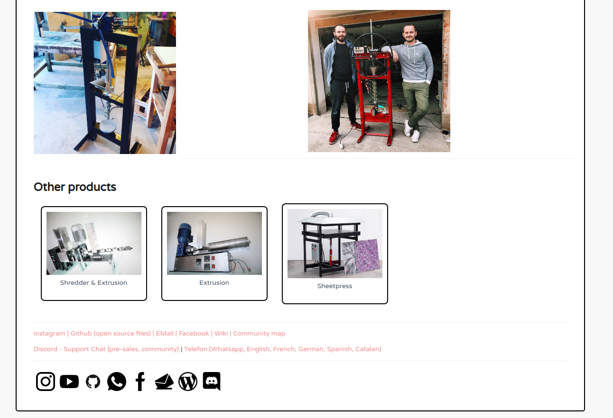

# Command 'bazar-vendor-html'

This command will compose HTML out of HTML & Markdown files to be used in the Precious-Plastic Bazar.

In this example, 


we're using a template for 'Other products', the footer which contains links and social icons.


## Install

1. Install [NodeJS](https://nodejs.org/en/download/)
2. run ```npm i -g @plastichub/cli```

## Usage
```sh

ph-cli bazar-vendor-html -config=products/config.json --product=elena
```

or if you are already in your products folder, just use

```sh
ph-cli bazar-vendor-html --product=elena
```

This will create an HTML file in ```products/elena/bazar/out/product.html```


### Example folder structure

There is a ready to folder in [./example](./example/products) but please also check [our version](https://github.com/plastic-hub/products) which we currently use for our products ([see new bazar example here](https://newbazar.preciousplastic.com/index.php?dispatch=products.view&product_id=99) ).

__example__ :
- __bazar__ (global templates and configuration)
  - [config.json](example/products/bazar/config.json) (global vendor variables being using in templates)
  - __fragments__ (templates)
    - [breadcrumb.md](example/products/bazar/fragments/breadcrumb.md) (a breadcrumb for the header of a product)
    - [product.html](example/products/bazar/fragments/product.html) (root template for a *product*)
    - [vendor\_links.html](example/products/bazar/fragments/vendor_links.html) (fragment containing links to vendor, eg: instagram)
- __products__
  - __elena__ (the product)
    - __bazar__ (bazar related files, this must be there )
      - __fragments__ (bazar templates)
        - [body.html](example/products/products/elena/bazar/fragments/body.html) (the actual description)
        - [footer.md](example/products/products/elena/bazar/fragments/footer.md) (the footer for the product)
      - __out__
        - [product.html](example/products/products/elena/bazar/out/product.html) (th final file)
    - [config.json](example/products/products/elena/config.json) (product related variables being used in the template)
    - __media__
      - [mold\_jack.jpg](example/products/products/elena/media/mold_jack.jpg)


### How does this work?

It loads templates or 'fragments' from various locations.
The templates can be HTML or Markdown. In particular it loads
templates from 2 different locations:

- ```products/bazar/fragments``` (global templates & content)
- ```products/myproduct/bazar/fragments``` (product related templates & content)

It will also load variables from 2 different locations which then can be used inside the templates :

- ```products/myproduct/config.json``` (product specific variables like name)
- ```products/bazar/config.json``` (vendor specific variables like email, website,...)


Once this templates are loaded, it replaces variable place holders with the content found by the same name. The variable can be a file or a variable value in the config.json files.

To generate the HTML for your product, there is a root template in [products/bazar/fragments/product.html]() :

```html
${breadcrumb} -> <span>${product_name}</span>

<hr/>

${header}
${body}
<hr/>
${others}
<hr/>
${vendor_links}
<hr/>
${footer}
```

As you can see, there are lot of variables, for instance we 
reference a variable ***breadcrumb***, written as follows :

```html
 ${breadcrumb}
```

This tool now looks for a file ```breadcrumb.html|md``` in the global and product template folders and replaces ${breadcrumb} with the content of this file whereby Markdown will be converted to HTML.

When this file doesn't exists, it tries the global or product config.json files.
